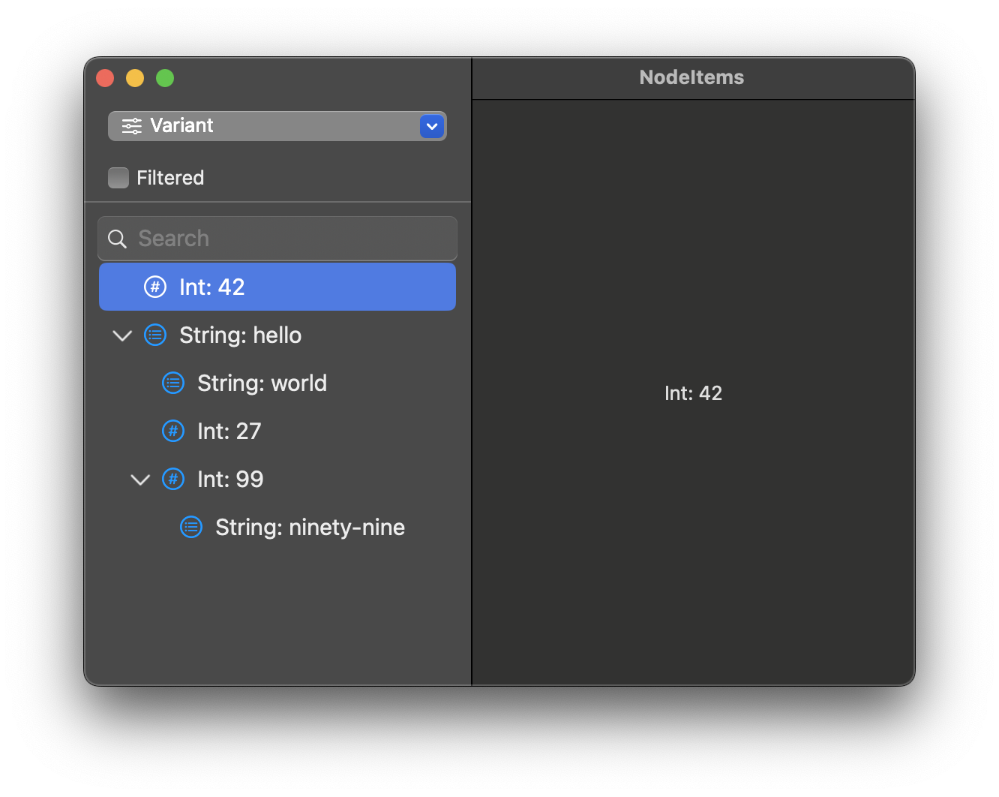

# NodeItems

## Description

NodeItems demostrates how to assemble an arbitrary collection of types in a navigation tree. It includes the ability to construct the tree using a resultBuilder. For example this:

```{
    42
    ("hello") {
        "world"
        27
        (99) {
            "ninety-nine"
        }
    }
}
```

would produce a node tree like:

```
42
 ∟ hello
   ∟ world
     27
     99
   	   ∟ "ninety-nine"
   	
```
		
or


